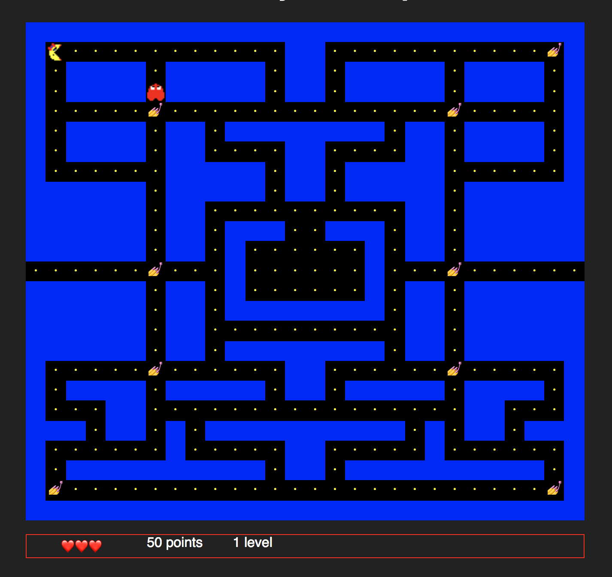

# Pac-Man with React & Styled components 💅

## goals

- Explore [Styled Components](https://www.styled-components.com/) in stress or unusual conditions.
- Having fun implementing an ever green 🎮
- Use pipe and curry as much as I can  

## What I built in 
- Responsive layout
- Tiles Map
- Tile renderer
- Pac-man & ghosts renderer 
- Mobile gestures via [Hammer](https://hammerjs.github.io/)
- PathFinder via [Pathfinding](https://github.com/qiao/PathFinding.js/)

try it [now](https://pacman.now.sh/)

## References
- [Styled Components](https://www.styled-components.com/)
- https://en.wikipedia.org/wiki/Pac-Man
